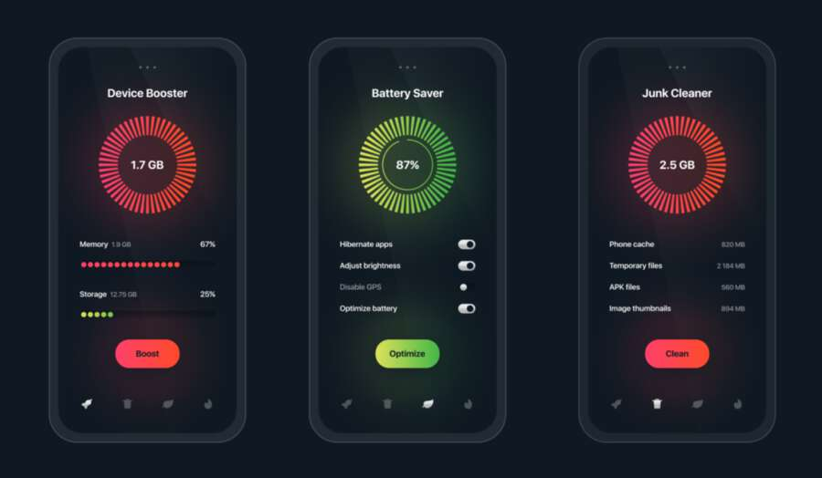

# Device Booster

We're working on [this Dribbble design today](https://dribbble.com/shots/14120527-Phone-cleaner-app) by the incredibly talented [Andrey Zhukov](https://dribbble.com/aminis):

I loved the shape of the CircleDiskThing as well as the dotty progress bars, and thought it'd be fun to make!

You can catch a video walkthrough of the entire example 📹 below:

## Steps

- [ ] Tabs
- [ ] Disk Thing Painter
- [ ] Dotted Progress Bars
- [ ] Fancy Buttons
